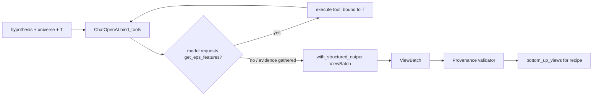

# Agentic BL Backtest — New Architecture & APIs

Implementation architecture for the system described in [agent_plan.md](./agent_plan.md).
Scope decisions already confirmed: synthetic point-in-time EPS data, a lightweight
temporal firewall (not the full `HistoricalSnapshot` class hierarchy), a new
standalone orchestrator (existing `backtest_orchestrator.py` is untouched), over
the 10 real equities already in `market_data.json`
(`AAPL, AMZN, BAC, GOOGL, JNJ, JPM, MSFT, PG, TSLA, WMT`).

This document covers two things: (1) the new modules/data flow, and (2) the new
REST APIs. The LLM orchestration internals (LangChain) have their own section,
§4, since that is the part with no existing precedent in this codebase.

---

## Table of Contents

1. [Component Map](#1-component-map)
2. [Data Flow — One Rebalance Period](#2-data-flow--one-rebalance-period)
3. [New APIs](#3-new-apis)
4. [LLM Agentic Orchestration (LangChain)](#4-llm-agentic-orchestration-langchain)
5. [New Files Summary](#5-new-files-summary)
6. [Dependencies](#6-dependencies)
7. [Open Questions](#7-open-questions)

---

## 1. Component Map

```
backend/
├── app/
│   ├── services/
│   │   └── eps_data/                          ← NEW
│   │       ├── generate_eps_data.py           ← synthetic EPS generator (one-off script)
│   │       ├── eps_store.py                   ← read/query layer over eps_estimates.json
│   │       └── eps_features.py                ← temporal firewall + feature computation
│   ├── orchestrators/
│   │   ├── eps_view_agent.py                  ← NEW — LangChain agent, evidence → views
│   │   ├── agentic_bl_backtest_orchestrator.py← NEW — rebalance loop, owns run lifecycle
│   │   ├── bl_orchestrator.py                 ← REUSED unchanged (run_black_litterman)
│   │   └── view_orchestrator.py               ← REUSED (recipe assembly helpers)
│   └── api/routers/
│       ├── agentic_backtest_router.py         ← NEW — run/list/inspect endpoints
│       └── eps_router.py                      ← NEW — debug/inspection endpoints
├── data/
│   ├── eps_estimates.json                     ← NEW — synthetic point-in-time EPS records
│   └── agentic_backtests/                     ← NEW — one JSON per run (results + audit trail)
```

Nothing under `backend/app/orchestrators/backtest_orchestrator.py` or
`bl_agent_orchestrator.py` is modified. The new orchestrator calls
`run_black_litterman()` the same way `bl_router.py` does today — it is a new
*caller* of existing BL code, not a change to it.

---

## 2. Data Flow — One Rebalance Period

```mermaid
sequenceDiagram
    participant Loop as agentic_bl_backtest_orchestrator
    participant Fw as eps_features (firewall)
    participant Agent as eps_view_agent (LangChain)
    participant Val as Provenance validator
    participant BL as bl_orchestrator.run_black_litterman

    Loop->>Loop: T = next rebalance date
    Loop->>Fw: compute_eps_features(asset, T) for each asset in universe
    Fw-->>Loop: features (only records with available_timestamp <= T)
    Loop->>Agent: invoke(hypothesis, universe, features, T)
    Agent->>Agent: tool call get_eps_features(asset) bound to T (re-validated, cannot escape T)
    Agent-->>Loop: structured views (asset, direction, expected_return, confidence, evidence_cited)
    Loop->>Val: validate(views, features)
    Val-->>Loop: accepted views (reject/neutral anything citing unsupplied evidence)
    Loop->>BL: run_black_litterman(recipe_with_views, price_data[:T])
    BL-->>Loop: weights
    Loop->>Loop: hold weights to T+1, apply txn costs, record realized return
    Loop->>Loop: write audit entry for T
```

The firewall boundary is `eps_features.py`: the agent (and the LangChain tool
that wraps it) never receives a raw EPS record, only the output of
`compute_eps_features(asset, T)`, which itself filters by
`available_timestamp <= T` before computing anything. `T` is closed over when
the tool is constructed for a given rebalance step — the agent has no
parameter that lets it request a different cutoff.

---

## 3. New APIs

### 3.1 Agentic backtest run lifecycle

Mirrors the existing `agent_router.py` pattern (`BackgroundTasks` + polling),
since a full run is many sequential LLM calls (one per rebalance date) and
would block an HTTP request otherwise.

| Method & Path | Purpose |
|---|---|
| `POST /agentic-backtest/run` | Start a new run. Body below. Returns `{run_id, status: "running"}` immediately. |
| `GET /agentic-backtest/runs` | List past runs: `run_id`, `hypothesis` (truncated), date range, universe, status, created_at. |
| `GET /agentic-backtest/runs/{run_id}` | Full result: equity curves (agent strategy + baselines), performance stats, list of rebalance dates. |
| `GET /agentic-backtest/runs/{run_id}/periods/{date}` | Single rebalance's audit entry: features supplied, views generated, provenance validation result, weights, realized return. |
| `DELETE /agentic-backtest/runs/{run_id}` | Remove a stored run (local file deletion only). |

**`POST /agentic-backtest/run` request body**

```jsonc
{
  "hypothesis": "Use earnings estimate revisions as the primary signal. ...",
  "universe": ["AAPL", "MSFT", "..."],   // optional, defaults to the 10-asset equity subset
  "start_date": "2021-01-01",
  "end_date": "2023-12-31",
  "rebalance_frequency": "monthly",       // only "monthly" supported initially
  "transaction_cost_bps": 10,
  "model": "gpt-4o-mini"                  // optional override
}
```

**`GET /agentic-backtest/runs/{run_id}` response shape**

```jsonc
{
  "run_id": "uuid",
  "hypothesis": "...",
  "universe": ["AAPL", "..."],
  "rebalance_dates": ["2021-01-29", "2021-02-26", "..."],
  "equity_curves": {
    "agent_bl": [{"date": "...", "value": 1.0}, ...],
    "equal_weight": [...],
    "market_cap_weight": [...],
    "bl_no_views": [...]
  },
  "performance_stats": {
    "agent_bl": {"cagr": 0.0, "vol": 0.0, "sharpe": 0.0, "max_drawdown": 0.0},
    "equal_weight": {...}, "market_cap_weight": {...}, "bl_no_views": {...}
  },
  "cost_summary": {"total_tokens": 0, "total_usd": 0.0}
}
```

### 3.2 Debug/inspection endpoints (for demoing the temporal firewall)

| Method & Path | Purpose |
|---|---|
| `GET /eps/{ticker}` | Full synthetic EPS revision history for a ticker, **not** time-filtered — for data inspection only. |
| `GET /eps/{ticker}/asof?date=YYYY-MM-DD` | Returns `compute_eps_features(ticker, date)` — the exact point-in-time view the agent would have seen. Useful to demonstrate that future revisions are excluded. |

---

## 4. LLM Agentic Orchestration (LangChain)

This is new: the existing `bl_agent_orchestrator.py` calls the raw `openai`
SDK directly with a hand-rolled ReAct loop (see
[AGENT_ARCHITECTURE.md §2](./AGENT_ARCHITECTURE.md)). That agent's job is to
*stress-test* a fixed recipe over up to 8 free-form tool-calling steps, so
hand-rolled control flow is tolerable there.

The new EPS view agent has a different shape: it runs **once per rebalance
date**, potentially dozens of times per backtest, and its only acceptable
output is a **schema-valid list of views** — there is no room for malformed
JSON or a wandering ReAct loop. That's the specific reason to bring in
LangChain here rather than extend the existing hand-rolled pattern:
structured-output parsing/retry and tool-binding are provided, instead of
re-implementing JSON-schema coercion and retry logic for every one of
potentially 36+ calls in a multi-year monthly backtest.

### 4.1 Package choice

- `langchain-core` + `langchain-openai` — chat model wrapper, tool binding,
  structured output. This is sufficient; **no `langgraph` dependency is
  needed** for this agent because there's no multi-turn graph state to
  checkpoint — one hypothesis + one evidence set in, one validated view list
  out, per call. (This is distinct from the `AGENT_ARCHITECTURE.md §3`
  LangGraph proposal, which is about the *other*, multi-step stress-testing
  agent.)
- No new vector store / retriever dependency — evidence is small, structured,
  and fits directly in the prompt; there's no unstructured corpus to embed.

### 4.2 Structured output schema

```python
from pydantic import BaseModel, Field
from typing import Literal

class AssetView(BaseModel):
    asset: str
    direction: Literal["positive", "negative", "neutral"]
    expected_return: float = Field(description="Signed scalar, e.g. 0.03 for +3%. 0.0 if neutral.")
    confidence: float = Field(ge=0.0, le=1.0)
    evidence_cited: list[str] = Field(description="Feature keys this view relies on, must be a subset of supplied features")
    rationale: str

class ViewBatch(BaseModel):
    views: list[AssetView]
```

### 4.3 Tool: the only data access path

```python
from langchain_core.tools import tool

def make_eps_tool(as_of: date, universe: list[str]):
    """Factory binds T; the agent cannot parameterize its way past the firewall."""
    @tool
    def get_eps_features(asset: str) -> dict:
        """Return point-in-time EPS revision features for `asset` as of the backtest clock."""
        if asset not in universe:
            return {"error": "asset not in universe"}
        return compute_eps_features(asset, as_of)   # eps_features.py — the actual firewall
    return get_eps_features
```

The agent is given this single tool plus the hypothesis text and asset list;
it is never given raw dates, raw EPS values, or any function that accepts a
timestamp argument.

### 4.4 Chain construction

```python
from langchain_openai import ChatOpenAI

def build_view_chain(as_of: date, universe: list[str], model: str = "gpt-4o-mini"):
    llm = ChatOpenAI(model=model, temperature=0.1, callbacks=[cost_tracking_callback])
    tool = make_eps_tool(as_of, universe)
    llm_with_tools = llm.bind_tools([tool])
    structured_llm = llm.with_structured_output(ViewBatch)
    # Two-stage: (1) let the model call get_eps_features for each asset it wants evidence on,
    # (2) once it has gathered evidence, force a structured ViewBatch as the final answer.
    ...
```

Implementation uses a small manual two-stage loop (call with tools bound →
execute any `get_eps_features` calls → re-invoke with
`with_structured_output(ViewBatch)` once the model stops requesting tools, or
after a max of `len(universe)` tool rounds). This is intentionally the
simplest LangChain pattern available — `AgentExecutor`/`create_react_agent`
would be overkill for a bounded, single-purpose tool-then-answer flow.

### 4.5 Cost tracking integration

A `BaseCallbackHandler` subclass (`cost_tracking_callback` above) implements
`on_llm_end` and writes to the **existing** `backend/data/llm_usage.db` via
the existing `LLMUsageTracker` ([tracker.py](../services/llm_client/tracker.py)),
with `service="eps_view_agent"`. This keeps all LLM spend — old agent and new
agent — visible in one place rather than introducing a second cost-tracking
mechanism.

### 4.6 Provenance validation (deterministic, not prompted)

After the chain returns a `ViewBatch`, `agentic_bl_backtest_orchestrator.py`
runs a plain Python check before any view reaches BL: for each `AssetView`,
every string in `evidence_cited` must match a key actually present in the
features dict returned to the agent for that asset at that `T`. Any view
failing this check is downgraded to neutral (dropped from `bottom_up_views`)
and flagged in the audit entry. This mirrors agent_plan.md §5's
"introduce unavailable factors as factual evidence" prohibition — enforced in
code, not by prompt instruction.

### 4.7 Per-call lifecycle summary



---

## 5. New Files Summary

| File | Responsibility |
|---|---|
| `backend/app/services/eps_data/generate_eps_data.py` | One-off generator: synthetic EPS estimates + revisions with publication lag, writes `data/eps_estimates.json` |
| `backend/app/services/eps_data/eps_store.py` | Load/query raw records from `eps_estimates.json` |
| `backend/app/services/eps_data/eps_features.py` | **Temporal firewall.** `compute_eps_features(asset, T)` — only path to EPS data for the agent |
| `backend/app/orchestrators/eps_view_agent.py` | LangChain chain: hypothesis + features → validated `ViewBatch` |
| `backend/app/orchestrators/agentic_bl_backtest_orchestrator.py` | Rebalance loop, recipe assembly, calls `run_black_litterman`, baselines, audit persistence |
| `backend/app/api/routers/agentic_backtest_router.py` | REST API per §3.1 |
| `backend/app/api/routers/eps_router.py` | REST API per §3.2 |
| `backend/data/eps_estimates.json` | Synthetic point-in-time EPS data store |
| `backend/data/agentic_backtests/*.json` | One file per run: equity curves, stats, per-period audit trail |

---

## 6. Dependencies

New additions to `backend/requirements.txt`, scoped to this feature only:

```
langchain-core
langchain-openai
```

No change to the existing `openai` package usage elsewhere in the codebase;
`langchain-openai` wraps the same OpenAI API and reuses the same
`OPENAI_API_KEY` environment variable.

---

## 7. Open Questions

1. Rebalance cadence vs. available price history — `load_market_data()`
   defaults to ~5 years daily; needs confirmation this gives enough monthly
   rebalance points for a meaningful comparison against baselines.
2. Whether the agent should see all 10 assets' features in a single call
   (current design, cheaper) vs. one call per asset (more granular audit
   trail, ~10x the LLM calls per rebalance).
3. Transaction cost model is currently flat bps-on-turnover; confirm this is
   sufficient for the first pass.
